### 1. Tài liệu thiết kế hệ thống

#### 1.1. Kiến trúc tổng thể (phân loại theo style)

Hệ thống UniHub không dùng một kiểu kiến trúc duy nhất, mà là **kiến trúc lai (hybrid architecture)**. Dựa trên cài đặt hiện tại, có thể phân loại như sau:

- **Client-Server**  
  - `frontend` (Next.js) và `mobile` (Expo) là client.  
  - `backend` (Express API) là server trung tâm.
- **Layered (phân lớp) bên trong Backend**  
  - API layer: `*.router.ts`  
  - Application/Domain layer: `*.service.ts`  
  - Data access/infra layer: repository + `shared/infra/*` (PostgreSQL, Redis, Queue adapter).
- **Event-Driven (bất đồng bộ theo sự kiện)**  
  - Backend publish event/job qua BullMQ (`registration_confirmed`, `notification.delivery`, `ai-summary.generate`, `workshop.changed`).  
  - Worker process tiêu thụ event và xử lý side effect.
- **Batch Sequential**  
  - CSV import chạy theo lịch (`nightly`, `evening`) theo chuỗi bước tuần tự: đọc file -> validate -> dedupe -> upsert -> archive -> ghi kết quả run.  
  - Payment reconciliation/expiry job cũng chạy theo lô định kỳ.
- **Pipe-and-Filter (cục bộ trong một số luồng xử lý)**  
  - Check-in sync: parse item -> verify QR -> validate workshop/registration -> insert idempotent -> map result.  
  - AI summary job: fetch PDF -> summarize -> persist trạng thái (`ready/fallback/failed`).
- **Modular Monolith (mức deploy/service)**  
  - Toàn bộ backend vẫn là một ứng dụng deployable chính, chia module theo bounded context: `auth`, `registration`, `payment`, `checkin`, `notification`, `admin`, `csv-import`, `workshop`, `ai-summary`.

#### 1.2. Cách các thành phần giao tiếp (gắn với từng kiểu kiến trúc)

- **Client-Server giao tiếp đồng bộ**  
  - Web/Mobile -> Backend qua HTTP(S) REST/JSON.  
  - Ví dụ: `/registrations`, `/payments/momo/callback`, `/checkin/sync`, `/admin/workshops/*`.
- **Layered nội bộ Backend**  
  - Router nhận request và validate input cơ bản.  
  - Service chứa nghiệp vụ + transaction boundary.  
  - Repository/Infra thực thi SQL, Redis command, queue publish.
- **Event-Driven giao tiếp bất đồng bộ**  
  - Service publish job vào Redis/BullMQ.  
  - Worker đọc queue và gọi kênh ngoài (email, AI, search indexing) hoặc cập nhật DB.
- **Batch Sequential giao tiếp theo lịch**  
  - Scheduler kích hoạt tác vụ theo cron.  
  - Từng bước xử lý có đầu ra làm đầu vào cho bước kế tiếp, và ghi trạng thái vào DB.
- **Offline-first cho mobile check-in**  
  - Khi offline: app ghi vào SQLite local queue.  
  - Khi online: app sync batch về server, server phản hồi từng item.

#### 1.3. Vì sao phân loại này phù hợp với cài đặt hiện tại

- Cấu trúc thư mục và mã nguồn backend thể hiện rõ phân lớp Router/Service/Infra.  
- Các queue/worker đã được cài đặt thực tế trong `shared/infra/queue.ts` và `src/workers/*`.  
- CSV import và reconciliation chạy theo mô hình batch theo lịch, không phải streaming realtime.  
- Các luồng check-in sync và AI summary được triển khai dưới dạng pipeline nhiều bước có thể map trực tiếp sang Pipe-and-Filter.  
- Dùng hybrid giúp giữ tốc độ triển khai (monolith) nhưng vẫn đạt khả năng mở rộng theo chiều sâu cho luồng tải cao và tác vụ nền.

#### 1.4. Ảnh hưởng khi thành phần gặp sự cố

| Thành phần lỗi | Ảnh hưởng trực tiếp | Ảnh hưởng dây chuyền | Cơ chế giảm thiểu |
|---|---|---|---|
| PostgreSQL | API ghi/đọc nghiệp vụ dừng | Đăng ký, check-in online, payment status bị ảnh hưởng nặng | Transaction + migration chuẩn hóa; có thể degrade phần read cache tạm thời |
| Redis | Peak gate, queue, circuit breaker state bị gián đoạn | Job async trễ; peak-control giảm hiệu quả | API lõi vẫn bám PostgreSQL |
| MoMo | Không tạo được phiên thanh toán | Workshop có phí bị gián đoạn | Circuit breaker fail-fast + reconciliation/expiry |
| Gemini/Cloudinary | Không sinh tóm tắt AI | Chỉ ảnh hưởng luồng AI summary | Mark `fallback/failed`, không chặn luồng đăng ký. Admin có thể tạo mô tả thủ công. |
| Resend | Không gửi email xác nhận | In-app notification vẫn hoạt động | Retry qua queue + trạng thái delivery |
| Elasticsearch | Tìm kiếm theo từ khóa lỗi/chậm | Trang list có thể vẫn xem khi không search | Giới hạn ảnh hưởng vào chức năng search |
| Mạng thiết bị check-in | Không gọi được API | Check-in online dừng tạm thời | Lưu hàng đợi SQLite + sync lại khi online |

---

### 2. C4 Diagram

#### 2.1. Level 1 - System Context

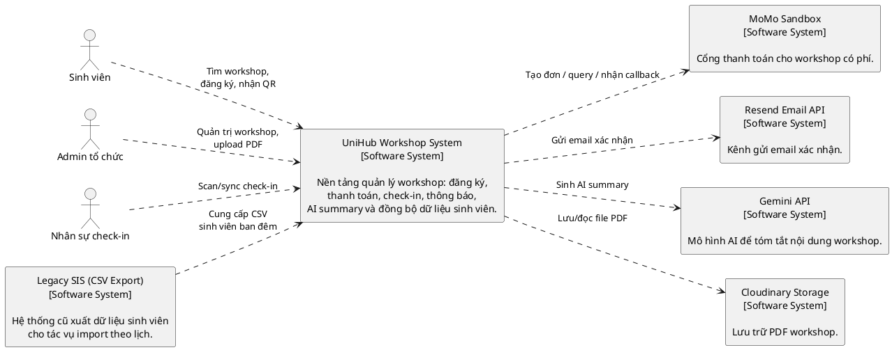

#### 2.2. Level 2 - Container

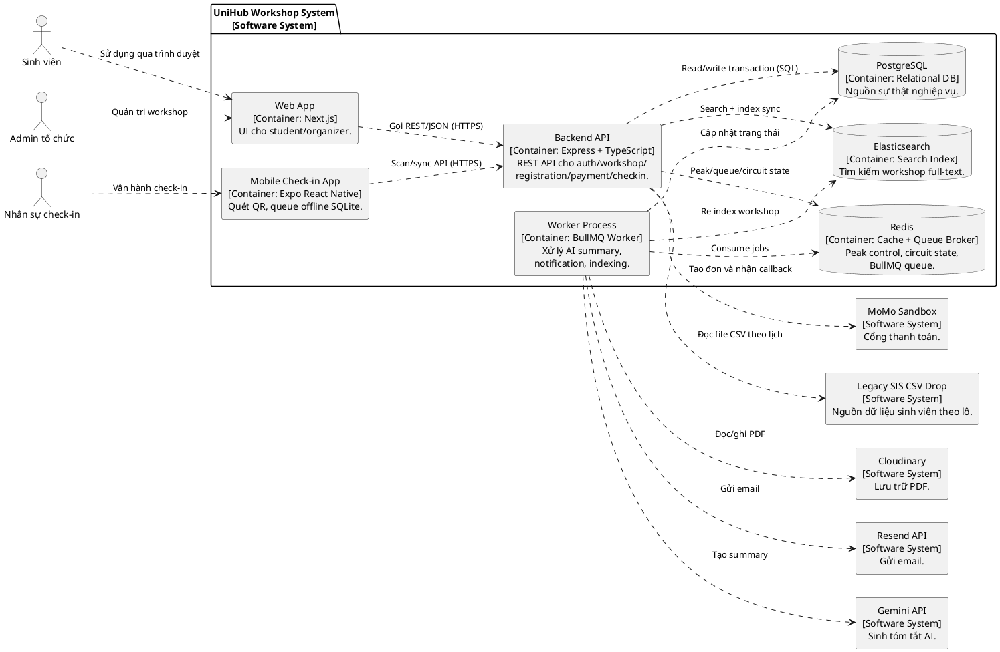

---

### 3. High-Level Architecture Diagram

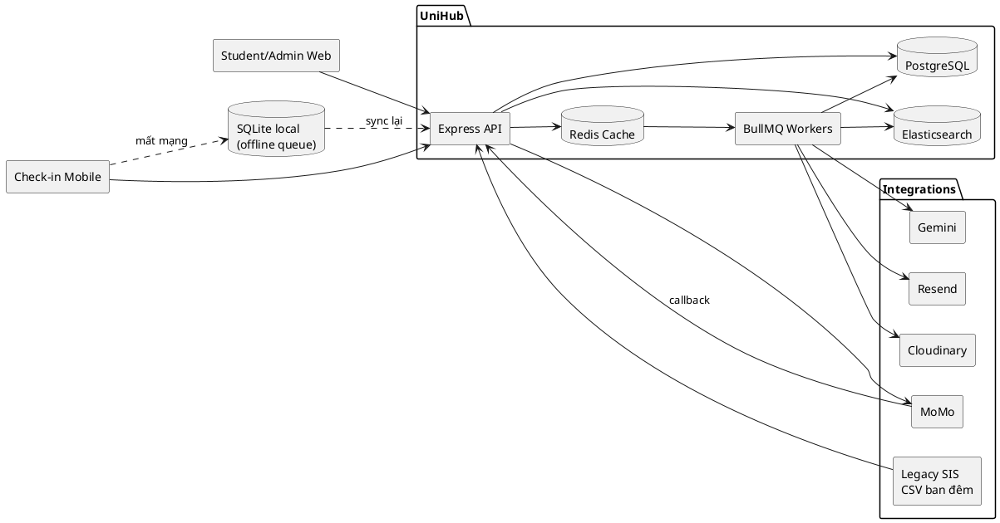

**Luồng dữ liệu nổi bật:**

- **Payment integration:** `POST /registrations` tạo reservation + payment pending trong PostgreSQL, gọi MoMo, callback quay lại `/payments/momo/callback`, cập nhật trạng thái trong transaction.
- **AI integration:** admin upload PDF -> API lưu storage + enqueue job -> worker gọi Gemini -> cập nhật `workshops.ai_summary`.
- **Legacy integration:** cron nightly/evening đọc CSV từ thư mục drop, validate, upsert `users` và ghi `csv_import_runs`.
- **Offline check-in:** mobile ghi check-in cục bộ (`pending_sync`) khi mất mạng; khi online gửi batch `/checkin/sync`, backend xử lý idempotent theo `device_scan_id`.

---

### 4. Thiết kế cơ sở dữ liệu

#### 4.1. Phân loại dữ liệu và lựa chọn DB

Hệ thống dùng mô hình **kết hợp (polyglot persistence)**:

- **PostgreSQL (SQL, nguồn sự thật):** users, workshops, registrations, payments, check-ins, notifications, audit logs, CSV import runs.
- **Redis (NoSQL key-value/in-memory):** peak admission queue/token, circuit breaker state, BullMQ queues, throttling counter.
- **SQLite trên mobile (local persistence):** hàng đợi check-in offline và cache roster/workshop trên thiết bị.
- **Elasticsearch (search index):** chỉ phục vụ truy vấn full-text workshop, không phải nguồn sự thật.

#### 4.2. Lý do chọn

- PostgreSQL đảm bảo ACID và khóa giao dịch tốt cho bài toán chống oversell/double-charge yêu cầu strong consistency và pessimistic lock.
- Redis xử lý tốt workload tần suất cao, TTL ngắn, và queue semantics.
- SQLite bảo toàn dữ liệu trên thiết bị khi app tắt đột ngột hoặc mất mạng.
- Elasticsearch tăng chất lượng tìm kiếm theo từ khóa nhiều trường.

#### 4.3. Schema các entity quan trọng

**`users`**

- `id (UUID, PK)`, `email (UNIQUE)`, `role CHECK(student|organizer|checkin_staff)`, `student_id`, `password_hash`, `force_change_password`, timestamps.

**`workshops`**

- `id (UUID, PK)`, metadata workshop, `capacity`, `reserved_count`, `confirmed_count`, `price_vnd`, `payment_required`, `status`.
- Ràng buộc: `confirmed_count <= reserved_count <= capacity`.

**`registrations`**

- `id (UUID, PK)`, `user_id`, `workshop_id`, `status CHECK(pending_payment|confirmed|cancelled|expired)`, `reservation_expires_at`, `qr_token_hash`, timestamps.
- Partial unique index chống duplicate active registration theo `(user_id, workshop_id)` khi trạng thái còn active.

**`payments`**

- `id (UUID, PK)`, `registration_id (UNIQUE)`, `idempotency_key (UNIQUE)`, `merchant_order_id (UNIQUE)`, `provider_order_id`, `status`, provider metadata/callback metadata.
- Index unique có điều kiện cho `provider_trans_id`, `provider_order_id`.

**`workshop_checkins`**

- `id (UUID, PK)`, `registration_id (UNIQUE)`, `workshop_id`, `user_id`, `checked_in_by`, `source`, `device_id`, `device_scan_id`, timestamps.
- Unique `(checked_in_by, device_id, device_scan_id)` để idempotent sync offline.

**`notification_deliveries` và `app_notifications`**

- Lưu delivery state theo kênh (`email`, `in_app`) và inbox in-app cho user.

**`csv_import_runs`**

- Theo dõi mỗi lần import (`nightly/evening`), outcome, metadata file, counters insert/update/error.

*Thông tin chi tiết về cài đặt schema, index:* Vui lòng ham khảo ở `backend/migrations`.

---

### 5. Mô tả các luồng nghiệp vụ quan trọng

#### 5.1. Luồng đăng ký workshop có phí (từ “Đăng ký” đến nhận QR)

**Thành phần tham gia:** Web App, API, PostgreSQL, Redis (peak/circuit), MoMo, Worker Notification.

1. Sinh viên bấm `Đăng ký`; frontend gửi `POST /registrations` kèm `Idempotency-Key` và `Admission-Token` (nếu peak-control đang bật).
2. API xác thực JWT (role `student`), kiểm tra admission/throttle và dọn các reservation quá hạn bằng `expireStaleRegistrations()`.
3. Service kiểm tra idempotency:
4. Nếu `Idempotency-Key` đã tồn tại và `request_hash` khớp, hệ thống replay kết quả cũ (không tạo thêm row).
5. Nếu key cũ nhưng request khác payload -> trả `409 IDEMPOTENCY_KEY_REUSED_WITH_DIFFERENT_REQUEST`.
6. Nếu không có active registration, API mở transaction, `SELECT workshop ... FOR UPDATE`, kiểm tra `reserved_count < capacity`, tăng `reserved_count`, tạo `registrations(pending_payment)` + `payments(pending_provider)`.
7. Commit transaction trước, sau đó gọi MoMo `createOrder` bên ngoài transaction để tránh giữ lock DB quá lâu.
8. Nếu provider trả `payUrl`, cập nhật payment và trả URL cho frontend redirect.
9. Nếu timeout/lỗi mạng/lỗi provider, cập nhật payment sang `unknown`; phía client dùng `GET /registrations/:id/payment-status` và hệ thống reconciliation sẽ tự đối soát lại.
10. Khi MoMo callback về `/payments/momo/callback`, backend verify signature, lock payment+registration, map status và cập nhật trạng thái trong cùng transaction.
11. Callback success hợp lệ: chuyển registration -> `confirmed`, tạo `qr_token` + `qr_token_hash`, tăng `confirmed_count`, enqueue event `registration_confirmed`.
12. Frontend poll `GET /registrations/:id/payment-status`; khi thấy `registration_status=confirmed` thì gọi `GET /registrations/:id/qr`.
13. API trả `qr_token` và `qr_issued_at`; frontend hiển thị mã QR cho sinh viên check-in.
14. Worker gửi email/in-app notification bất đồng bộ (không ảnh hưởng tính đúng đắn payment nếu enqueue lỗi).

**Sơ đồ PlantUML (end-to-end):**

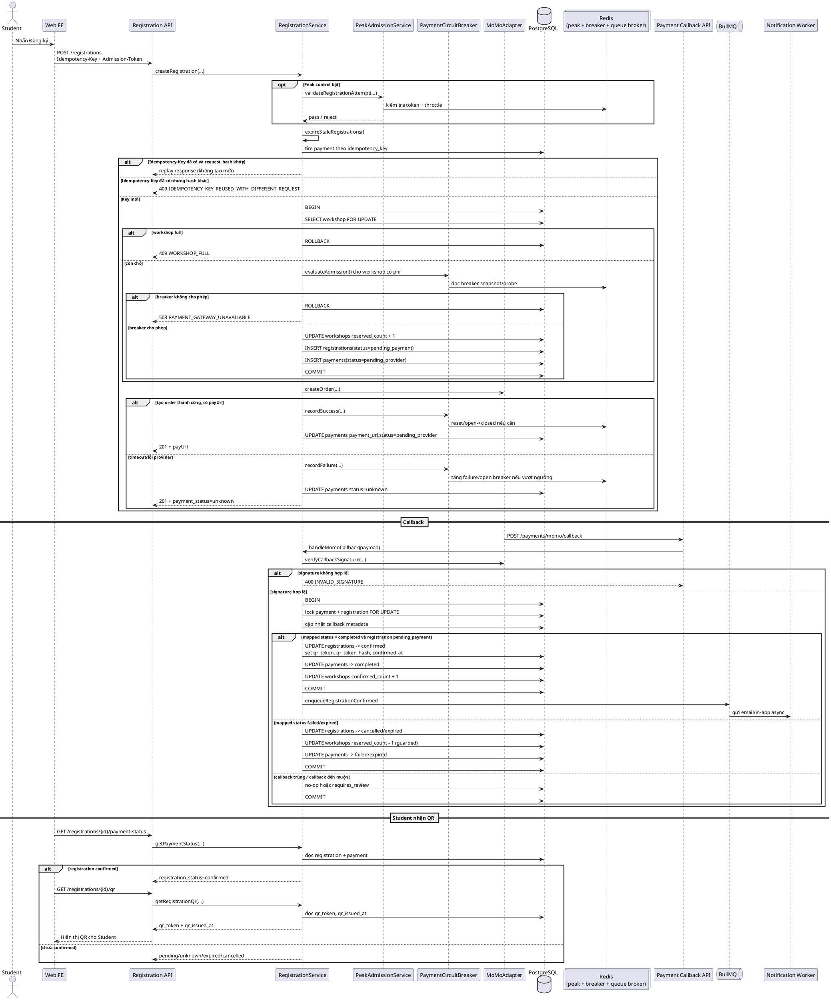

**Xử lý lỗi giữa chừng (theo implementation hiện tại):**

- Reuse key sai payload -> `409 IDEMPOTENCY_KEY_REUSED_WITH_DIFFERENT_REQUEST`.
- Workshop hết chỗ -> `409 WORKSHOP_FULL`.
- Gateway không ổn định -> `503 PAYMENT_GATEWAY_UNAVAILABLE` (circuit breaker fail-fast).
- Timeout/lỗi mạng lúc tạo order -> payment chuyển `unknown`, reconciliation xử lý sau.
- Callback trùng lặp -> idempotent no-op, không tăng/giảm counter lặp.
- Callback success đến muộn khi registration đã terminal -> payment `requires_review`, không auto-confirm để tránh oversell.

#### 5.2. Luồng check-in khi mất mạng và đồng bộ lại

**Thành phần tham gia:** Mobile App, SQLite local, API `/checkin/sync`, PostgreSQL.

1. Staff đăng nhập bằng tài khoản `checkin_staff`, chọn workshop cần vận hành.
2. Khi offline, app quét QR, decode claims cục bộ, kiểm tra mismatch/đã hủy/đã scan local.
3. App ghi record vào SQLite với `status=pending_sync`, gồm `device_id`, `device_scan_id`, `qr_token`, `scanned_at_device`.
4. Khi mạng trở lại, app gom batch (mặc định chunk 25) gọi `POST /checkin/sync`.
5. API verify từng token, kiểm tra eligibility registration/workshop, ghi `workshop_checkins` bằng `INSERT ... ON CONFLICT DO NOTHING`.
6. API trả kết quả từng item (`checked_in`, `already_checked_in`, hoặc lỗi nghiệp vụ).
7. Mobile đánh dấu `synced` cho các item đã settled (`checked_in` và `already_checked_in`), giữ lại item lỗi để retry.

**Sơ đồ PlantUML (offline -> sync):**

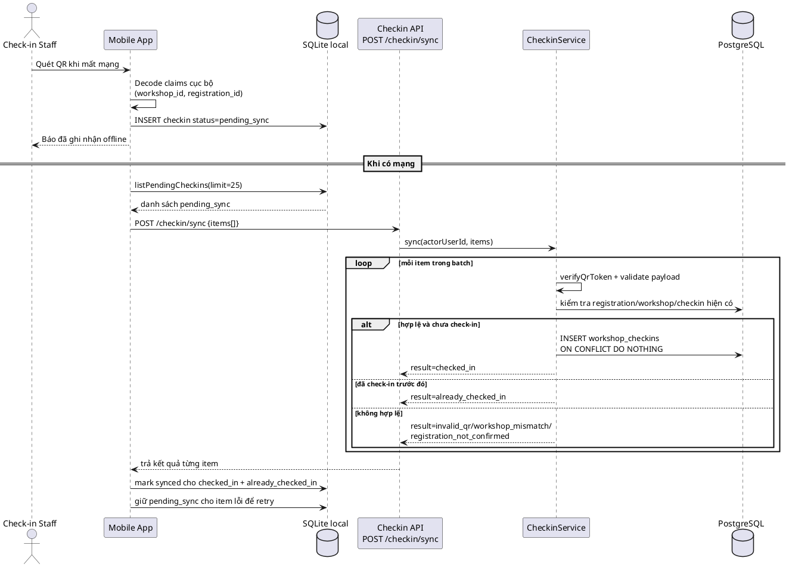

**Xử lý lỗi giữa chừng:**

- Payload sai format -> `400 INVALID_SYNC_PAYLOAD`.
- Token hỏng/hết hạn -> `invalid_qr`, item được giữ để xử lý thủ công hoặc bỏ.
- Mất mạng khi sync -> không mất dữ liệu vì SQLite vẫn giữ queue.
- Trùng check-in từ thiết bị khác -> trả `already_checked_in`, app coi là conflict đã giải quyết.

#### 5.3. Luồng nhập dữ liệu từ CSV đêm

**Thành phần tham gia:** CSV drop directory (legacy export), CSV import cron, API service layer, PostgreSQL.

1. Scheduler chạy theo `CSV_IMPORT_NIGHTLY_CRON` và `CSV_IMPORT_EVENING_CRON` (nếu bật `CSV_IMPORT_ENABLED=true`).
2. Service tạo `csv_import_runs` trạng thái `running`, kiểm tra file tồn tại/kích thước/hash.
3. Nếu file thiếu -> `skipped_missing`; nếu hash trùng hoặc mtime cũ -> `skipped_stale`.
4. Parse CSV, validate từng dòng (`student_id`, `email`, `full_name`, format), tính error rate.
5. Nếu error rate vượt ngưỡng `CSV_ERROR_THRESHOLD` -> `failed_validation`, không áp dụng dữ liệu mới.
6. Nếu hợp lệ: upsert vào bảng người dùng, ghi counters inserted/updated.
7. Archive file vào thư mục `processed/` và kết thúc run `processed`.

**Sơ đồ PlantUML (batch import ban đêm):**

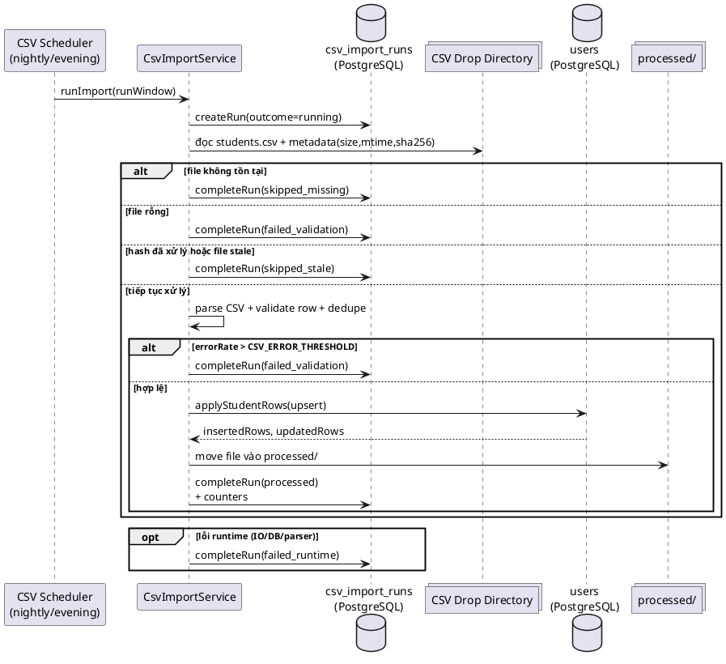

**Xử lý lỗi giữa chừng:**

- Exception runtime (IO, DB, parser) -> run kết thúc `failed_runtime`.
- Luôn ghi nhật ký run và lý do để vận hành có thể truy vết.
- Khi import fail, hệ thống giữ dữ liệu sinh viên thành công gần nhất (không làm gián đoạn đăng nhập/đăng ký).

---

### 6. Thiết kế kiểm soát truy cập

#### 6.1. Mô hình phân quyền

Hệ thống dùng **RBAC** với 3 role trong JWT claim `role`:

- `student`: xem workshop, đăng ký, xem payment/QR, đọc notification.
- `organizer`: quản trị workshop, dashboard, audit logs, upload PDF, override summary.
- `checkin_staff`: dùng API check-in (`scan`, `sync`, `roster`, `cancelled-since`).

#### 6.2. Ma trận quyền chính

| Tác vụ | student | organizer | checkin_staff |
|---|---|---|---|
| Xem danh sách/chi tiết workshop | Có | Có | Có (qua mobile cache/API) |
| Đăng ký workshop | Có | Không | Không |
| Xem QR của registration | Có (của chính mình) | Không | Không |
| Quản trị workshop (`/admin/*`) | Không | Có | Không |
| Check-in scan/sync | Không | Không | Có |
| Xem notification inbox | Có | Không mặc định | Không mặc định |

#### 6.3. Điểm kiểm tra quyền theo từng lớp truy cập

- **API endpoint**
  - `authenticate` middleware: verify JWT (`type=access`, signature, expiry).
  - `authorize([roles])`: chặn 403 nếu role không nằm trong danh sách cho endpoint.
  - Mapping hiện tại:
    - `/admin/*` -> `organizer`
    - `/registrations/*`, `/notifications/*`, `/workshops/:id/admission` -> `student`
    - `/checkin/*` -> `checkin_staff`

- **Web app**
  - `frontend/middleware.ts` đọc cookie `access_token`, decode role.
  - Nếu chưa đăng nhập -> redirect `/login`; sai role -> redirect `/403`.

- **Mobile app**
  - `mobile/lib/auth.ts` dùng `ensureStaffUser`, chỉ chấp nhận `checkin_staff`.
  - Nếu login token hợp lệ nhưng role khác -> `StaffRoleError`, không cho vào luồng vận hành check-in.

#### 6.4. Nguyên tắc bảo mật bổ sung

- Không tin UI/client role check; kiểm tra role bắt buộc ở API.
- Dùng access token ngắn hạn + refresh token lưu bảng `refresh_tokens` để revoke.
- Endpoint nhạy cảm có thêm throttle/rate limit.
- Mọi thay đổi quản trị workshop đều ghi `audit_logs` để truy vết.

---
### 7. Thiết kế các cơ chế bảo vệ hệ thống

Để đảm bảo hệ thống UniHub hoạt động ổn định dưới áp lực lớn (ví dụ: đợt mở đăng ký toàn trường) và sự bất ổn của các đối tác bên thứ ba (Cổng thanh toán), nhóm đã thiết kế và áp dụng các cơ chế bảo vệ nhiều lớp.

#### 7.1. Kiểm soát tải đột biến (Peak Load Control)

**Vấn đề:** Làm thế nào để backend API không bị sập khi 12.000 sinh viên truy cập và nhấn "Đăng ký" cùng lúc vào giờ cao điểm?

**Giải pháp lựa chọn: Mô hình Virtual Waiting Room kết hợp 3-Layer Throttling trên Redis.**

**Cách hoạt động:**
Hệ thống không cho phép luồng ghi trực tiếp đập vào Database. Thay vào đó, tất cả người dùng phải đi qua một "phòng chờ" được quản lý hoàn toàn trên Cache (Redis).

1. **Kiểm soát throttle vòng ngoài (Poll Throttle):** Dùng lệnh `SET NX EX` trên Redis để chặn người dùng nhấn F5 hoặc gửi request liên tục. Ai nhấn quá nhanh sẽ bị văng lỗi `429 RATE_LIMITED` ngay ở cổng API.
2. **Xếp hàng bằng ZSET:** Người dùng hợp lệ được đưa vào hàng đợi `Sorted Set` trên Redis với score là Timestamp tại lúc mà họ được đưa vào hàng đợi. Hệ thống tính toán `admitBudget` - số lượng sinh viên cho phép để lấy ra khỏi hàng chờ để được chính thức đăng ký workshop, được tính toán theo công thức:
$$Budget = \max(0, (Capacity + QueueBuffer) - ActiveTokens)$$
Điều kiện quyết định số phận của sinh viên đó là: $Rank < admitBudget$.

3. **Kiểm soát lưu lượng toàn cục:** Ngay cả khi có vé, trước khi chạm vào Database, hệ thống vẫn đếm tổng số request ghi trong 1 giây (`globalWriteCounter`). Nếu vượt ngưỡng an toàn (mặc định: 100 req/s), request sẽ bị chặn kèm lỗi `503 REGISTRATION_BUSY`.

**Sơ đồ PlantUML:**

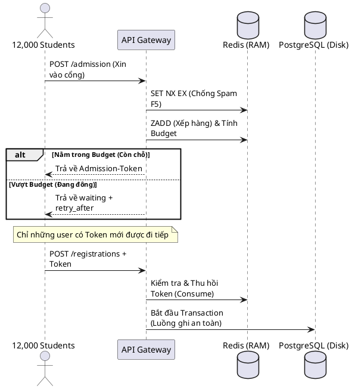

**Lý do phù hợp:** Redis có khả năng xử lý hàng chục ngàn thao tác trên giây (O(log N) với ZSET). Nhờ chặn trước toàn bộ 12.000 request đầu tiên bằng Redis, PostgreSQL phía sau được giảm tải bằng nhiều cơ chế, chỉ phải xử lý một lượng nhỏ request đã được lọc qua token.

---

#### 7.2. Xử lý cổng thanh toán không ổn định (Circuit Breaker)

**Vấn đề:** Khi cổng MoMo bị lỗi hoặc timeout liên tục, làm sao để server UniHub không bị treo theo do phải chờ đợi kết nối mạng?

**Giải pháp lựa chọn: Mẫu thiết kế Bộ Ngắt Mạch (Circuit Breaker Pattern) kết hợp Graceful Degradation.**

**Cách hoạt động:**
Hệ thống duy trì một State Machine trên Redis để theo dõi sức khỏe của cổng MoMo.

* **CLOSED (Bình thường):** Cho phép gọi MoMo. Nếu lỗi liên tục vượt ngưỡng (`FAILURE_THRESHOLD`), mạch chuyển sang OPEN.
* **OPEN (Ngắt mạch):** Chặn ĐỨNG mọi yêu cầu đăng ký workshop có phí NGAY LẬP TỨC. Trả về lỗi `503 PAYMENT_GATEWAY_UNAVAILABLE` mà không cần gọi MoMo, không cần mở kết nối Database.
* **HALF_OPEN (Thăm dò):** Sau một thời gian (`OPEN_DURATION`), mạch hé mở cho đúng 1 request (`PROBE_LIMIT`) đi qua để thử. Nếu thành công -> mạch đóng lại (CLOSED). Nếu thất bại -> mạch mở lại (OPEN).

**Sơ đồ PlantUML:**

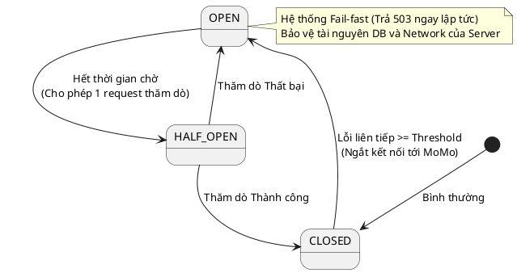

**Lý do phù hợp:** Nó giúp hệ thống tự kết thúc sớm các luồng đăng ký có phí nếu detect được dịch vụ thanh toán bị lỗi. Thay vì để hàng ngàn kết nối bị treo chờ MoMo timeout (gây cạn kiệt Connection Pool), mạch sẽ ngắt để server rảnh tay phục vụ các tính năng khác (như xem thông tin hoặc đăng ký workshop miễn phí, đây gọi là Graceful Degradation).

---

#### 7.3. Chống trừ tiền hai lần (Idempotency)

**Vấn đề:** Sinh viên bị lag mạng, nhấn đúp nút "Thanh toán" nhiều lần. Làm sao để đảm bảo hệ thống không tạo 2 mã đơn hàng MoMo và trừ tiền 2 lần?

**Giải pháp lựa chọn: Cơ chế Lũy đẳng (Idempotency Key) và Khóa bi quan (Pessimistic Locking).**

**Cách hoạt động:**

1. **Idempotency-Key:** Frontend tự sinh ra một mã UUID duy nhất cho mỗi attempt đăng ký và gắn vào Header. Backend sử dụng mã này làm chìa khóa. Điều này giúp đảm bảo 1 sinh viên đăng ký 1 workshop nhiều lần sẽ không làm thay đổi kết quả cuối cùng. 
2. **Request Hash:** Backend băm nội dung body của request. Nếu user dùng Key cũ nhưng đổi workshop khác, hệ thống chặn ngay (lỗi 409).
3. **Khôi phục trạng thái (Replay):** Nếu truy vấn Database thấy `Idempotency-Key` đã tồn tại và đơn hàng đang `pending_payment`, hệ thống KHÔNG gọi MoMo tạo đơn mới. Nó chỉ đơn giản là đọc URL thanh toán cũ (QR Momo) từ Database và trả lại cho Frontend.

**Sơ đồ PlantUML:**

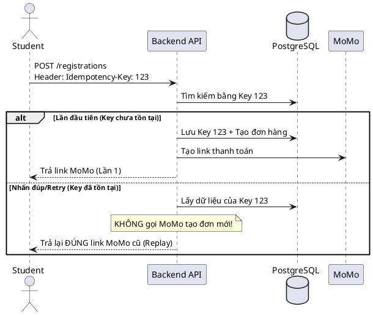

**Lý do phù hợp:** Giao tiếp qua mạng internet luôn có rủi ro rớt gói tin. Idempotency Key giúp định danh giao dịch bằng cách lưu trữ key sang Database, giúp client có thể gọi lại API nhiều lần mà hệ quả vẫn không đổi.

---

#### 7.4. Các vấn đề khác đã được khắc phục đồng thời

Bên cạnh các cơ chế điều tiết lưu lượng và ngắt mạch chủ động ở vòng ngoài, kiến trúc lõi của hệ thống UniHub còn giải quyết triệt để ba bài toán kinh điển liên quan đến tính toàn vẹn dữ liệu, tranh chấp tài nguyên và đồng bộ trạng thái bất đồng bộ.

##### 7.4.1. Khắc phục mất gói tin từ nhà cung cấp (Payment Provider - Momo) bằng cơ chế chủ động đối soát

**Vấn đề kỹ thuật:**
Sau khi hệ thống giữ chỗ thành công ngoài Database và gọi sang cổng MoMo, các trường hợp như mạng Internet bị ngắt quãng khiến Webhook Callback từ MoMo gửi về UniHub bị mất. Hệ quả là đơn hàng bị treo vĩnh viễn ở trạng thái `pending_provider` hoặc `unknown`, gây ra các hành vi sai lệch không mong muốn.

**Giải pháp và Nguyên lý hoạt động:**
Nhóm áp dụng mô hình thiết kế **Đạt tính nhất quán cuối (Eventual Consistency)** bằng cách sử dụng trạng thái không cho kết quả không xác định `unknown` và một tiến trình đối soát chạy ngầm `runReconciliationBatch`.

* **Chuyển dịch trạng thái an toàn:** Khi có sự cố kết nối mạng xảy ra lúc gọi MoMo, hệ thống chuyển bản ghi đăng ký sang trạng thái tạm thời là `unknown`.
* **Tác vụ quét Batch chạy ngầm:** Một tác vụ định kỳ sẽ kích hoạt hàm `runReconciliationBatch(limit)`. Nó sử dụng từ khóa `SKIP LOCKED`, cho phép cron job bỏ qua các hàng đang bị khóa bởi các tiến trình khác.
* **Đối soát chủ động:** Hệ thống lấy mã đơn `provider_order_id` gọi chủ động sang API kiểm tra của MoMo. Dựa vào kết quả trả về, hệ thống tái sử dụng chung một khối logic map trạng thái trả về từ MoMo (`applyProviderResult`) giống như luồng Callback chuẩn để cập nhật chính xác kết quả về trạng thái đích cuối cùng (`completed` hoặc `failed`).

**Sơ đồ Tiến trình Đối soát Chủ động (PlantUML):**

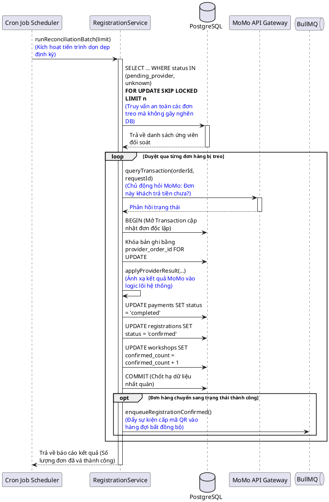

---

#### 7.4.2. Thu hồi tài nguyên giữ chỗ rác (Stale Reservations Expiry)

**Vấn đề kỹ thuật:**
Sinh viên tiến hành nhấn nút đăng ký và hệ thống đã thực hiện giữ chỗ thành công (`reserved_count` tăng), nhưng sinh viên đó lại cố tình không quét mã thanh toán MoMo hoặc tắt app. Nếu không giải phóng, số ghế này sẽ bị chiếm mãi.

**Giải pháp và Nguyên lý hoạt động:**
Hệ thống thiết lập **Time-To-Live cho cơ chế giữ chõ** thông qua thuộc tính `reservation_expires_at` lưu trong bảng dữ liệu.

Hàm `expireStaleRegistrations()` được cấu hình chạy tự động ở tần suất cao.

* Tiến trình thực hiện truy vấn: `SELECT ... WHERE status='pending_payment' AND reservation_expires_at < NOW() FOR UPDATE SKIP LOCKED` để lọc ra các đơn đã quá hạn thanh toán một cách an toàn.
* Với mỗi đơn rác tìm thấy, hệ thống thực hiện thực hiện atomic update để đưa trạng thái đăng ký và thanh toán về `expired` và trả lại chỗ trống cho workshop.

**Sơ đồ Tiến trình Giải phóng Suất rác (PlantUML):**

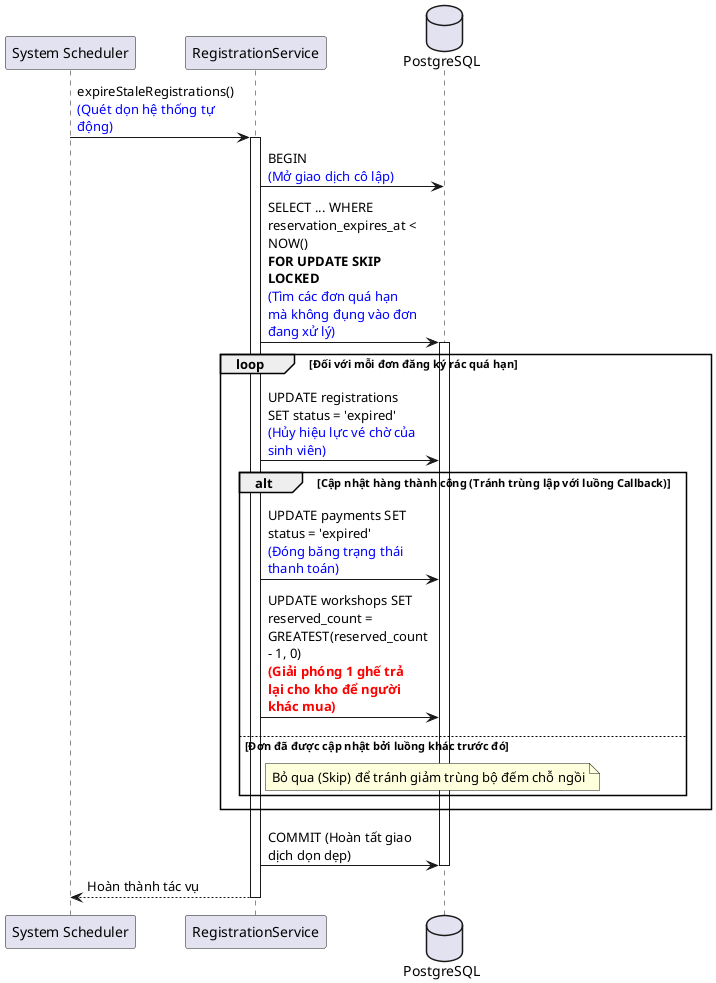
---
