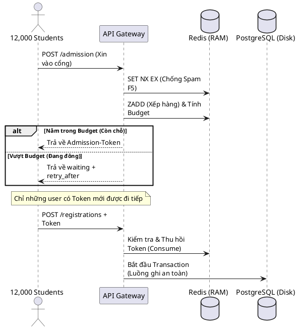
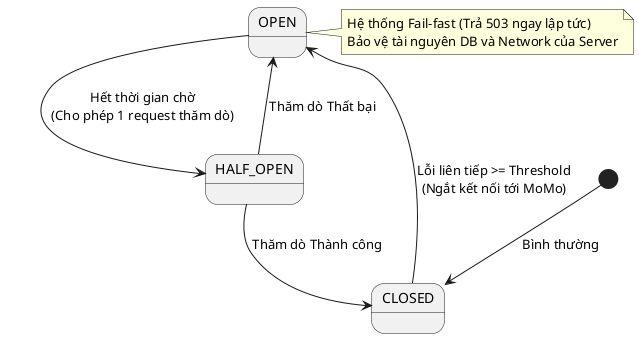
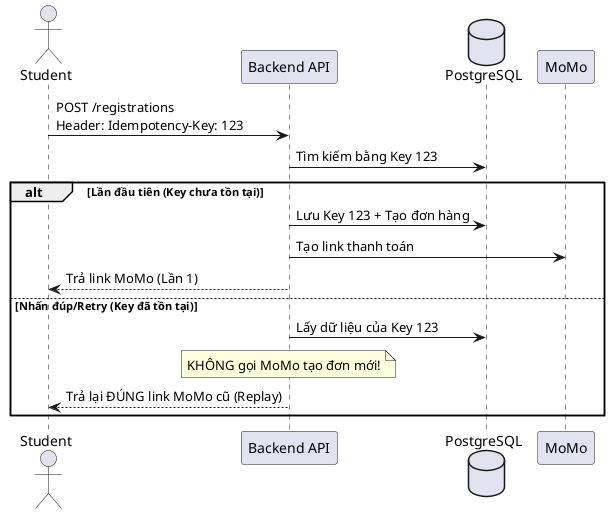
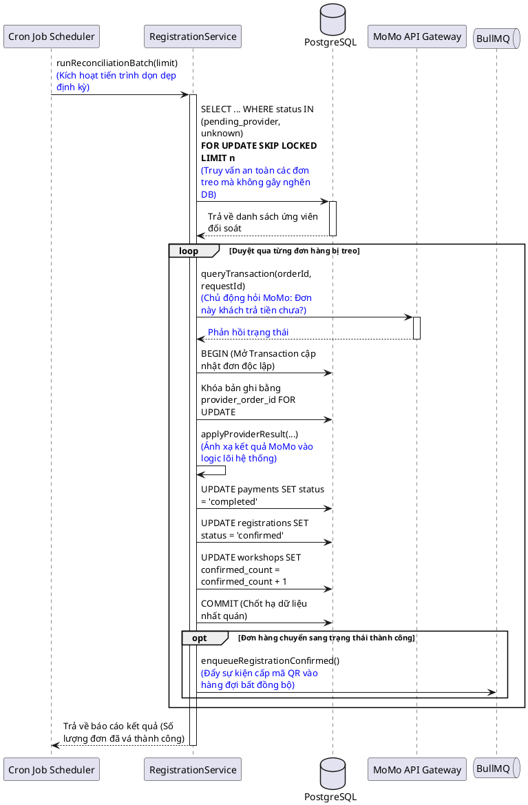
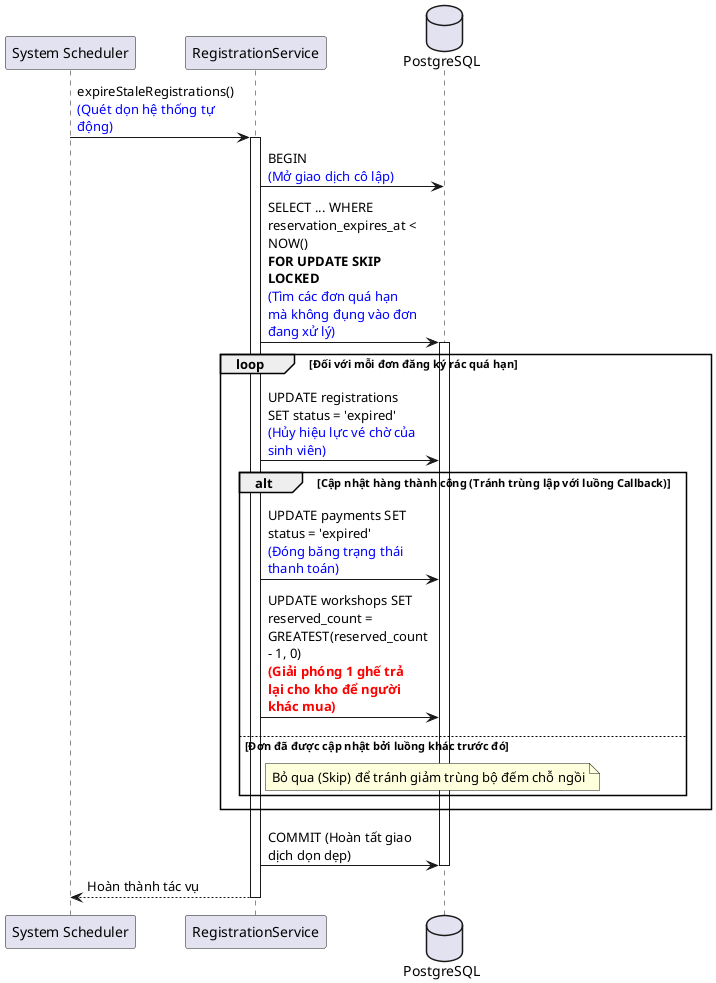

### 7. Thiết kế các cơ chế bảo vệ hệ thống

Để đảm bảo hệ thống UniHub hoạt động ổn định dưới áp lực lớn (ví dụ: đợt mở đăng ký toàn trường) và sự bất ổn của các đối tác bên thứ ba (Cổng thanh toán), nhóm đã thiết kế và áp dụng các cơ chế bảo vệ nhiều lớp.

#### 7.1. Kiểm soát tải đột biến (Peak Load Control)

**Vấn đề:** Làm thế nào để backend API không bị sập khi 12.000 sinh viên truy cập và nhấn "Đăng ký" cùng lúc vào giờ cao điểm?

**Giải pháp lựa chọn: Mô hình Virtual Waiting Room kết hợp 3-Layer Throttling trên Redis.**

**Cách hoạt động:**
Hệ thống không cho phép luồng ghi trực tiếp đập vào Database. Thay vào đó, tất cả người dùng phải đi qua một "phòng chờ" được quản lý hoàn toàn trên Cache (Redis).

1. **Kiểm soát throttle vòng ngoài (Poll Throttle):** Dùng lệnh `SET NX EX` trên Redis để chặn người dùng nhấn F5 hoặc gửi request liên tục. Ai nhấn quá nhanh sẽ bị văng lỗi `429 RATE_LIMITED` ngay ở cổng API.
2. **Xếp hàng bằng ZSET:** Người dùng hợp lệ được đưa vào hàng đợi `Sorted Set` trên Redis với score là Timestamp tại lúc mà họ được đưa vào hàng đợi. Hệ thống tính toán `admitBudget` - số lượng sinh viên cho phép để lấy ra khỏi hàng chờ để được chính thức đăng ký workshop, được tính toán theo công thức:
$$Budget = \max(0, (Capacity + QueueBuffer) - ActiveTokens)$$
Điều kiện quyết định số phận của sinh viên đó là: $Rank < admitBudget$.

3. **Kiểm soát lưu lượng toàn cục:** Ngay cả khi có vé, trước khi chạm vào Database, hệ thống vẫn đếm tổng số request ghi trong 1 giây (`globalWriteCounter`). Nếu vượt ngưỡng an toàn (mặc định: 100 req/s), request sẽ bị chặn kèm lỗi `503 REGISTRATION_BUSY`.

**Sơ đồ PlantUML:**

**Lý do phù hợp:** Redis có khả năng xử lý hàng chục ngàn thao tác trên giây (O(log N) với ZSET). Nhờ chặn trước toàn bộ 12.000 request đầu tiên bằng Redis, PostgreSQL phía sau được giảm tải bằng nhiều cơ chế, chỉ phải xử lý một lượng nhỏ request đã được lọc qua token.

---

#### 7.2. Xử lý cổng thanh toán không ổn định (Circuit Breaker)

**Vấn đề:** Khi cổng MoMo bị lỗi hoặc timeout liên tục, làm sao để server UniHub không bị treo theo do phải chờ đợi kết nối mạng?

**Giải pháp lựa chọn: Mẫu thiết kế Bộ Ngắt Mạch (Circuit Breaker Pattern) kết hợp Graceful Degradation.**

**Cách hoạt động:**
Hệ thống duy trì một State Machine trên Redis để theo dõi sức khỏe của cổng MoMo.

* **CLOSED (Bình thường):** Cho phép gọi MoMo. Nếu lỗi liên tục vượt ngưỡng (`FAILURE_THRESHOLD`), mạch chuyển sang OPEN.
* **OPEN (Ngắt mạch):** Chặn ĐỨNG mọi yêu cầu đăng ký workshop có phí NGAY LẬP TỨC. Trả về lỗi `503 PAYMENT_GATEWAY_UNAVAILABLE` mà không cần gọi MoMo, không cần mở kết nối Database.
* **HALF_OPEN (Thăm dò):** Sau một thời gian (`OPEN_DURATION`), mạch hé mở cho đúng 1 request (`PROBE_LIMIT`) đi qua để thử. Nếu thành công -> mạch đóng lại (CLOSED). Nếu thất bại -> mạch mở lại (OPEN).

**Sơ đồ PlantUML:**

**Lý do phù hợp:** Nó giúp hệ thống tự kết thúc sớm các luồng đăng ký có phí nếu detect được dịch vụ thanh toán bị lỗi. Thay vì để hàng ngàn kết nối bị treo chờ MoMo timeout (gây cạn kiệt Connection Pool), mạch sẽ ngắt để server rảnh tay phục vụ các tính năng khác (như xem thông tin hoặc đăng ký workshop miễn phí, đây gọi là Graceful Degradation).

---

#### 7.3. Chống trừ tiền hai lần (Idempotency)

**Vấn đề:** Sinh viên bị lag mạng, nhấn đúp nút "Thanh toán" nhiều lần. Làm sao để đảm bảo hệ thống không tạo 2 mã đơn hàng MoMo và trừ tiền 2 lần?

**Giải pháp lựa chọn: Cơ chế Lũy đẳng (Idempotency Key) và Khóa bi quan (Pessimistic Locking).**

**Cách hoạt động:**

1. **Idempotency-Key:** Frontend tự sinh ra một mã UUID duy nhất cho mỗi attempt đăng ký và gắn vào Header. Backend sử dụng mã này làm chìa khóa. Điều này giúp đảm bảo 1 sinh viên đăng ký 1 workshop nhiều lần sẽ không làm thay đổi kết quả cuối cùng. 
2. **Request Hash:** Backend băm nội dung body của request. Nếu user dùng Key cũ nhưng đổi workshop khác, hệ thống chặn ngay (lỗi 409).
3. **Khôi phục trạng thái (Replay):** Nếu truy vấn Database thấy `Idempotency-Key` đã tồn tại và đơn hàng đang `pending_payment`, hệ thống KHÔNG gọi MoMo tạo đơn mới. Nó chỉ đơn giản là đọc URL thanh toán cũ (QR Momo) từ Database và trả lại cho Frontend.

**Sơ đồ PlantUML:**

**Lý do phù hợp:** Giao tiếp qua mạng internet luôn có rủi ro rớt gói tin. Idempotency Key giúp định danh giao dịch bằng cách lưu trữ key sang Database, giúp client có thể gọi lại API nhiều lần mà hệ quả vẫn không đổi.

---

#### 7.4. Các vấn đề khác đã được khắc phục đồng thời

Bên cạnh các cơ chế điều tiết lưu lượng và ngắt mạch chủ động ở vòng ngoài, kiến trúc lõi của hệ thống UniHub còn giải quyết triệt để ba bài toán kinh điển liên quan đến tính toàn vẹn dữ liệu, tranh chấp tài nguyên và đồng bộ trạng thái bất đồng bộ.

##### 7.4.1. Khắc phục mất gói tin từ nhà cung cấp (Payment Provider - Momo) bằng cơ chế chủ động đối soát

**Vấn đề kỹ thuật:**
Sau khi hệ thống giữ chỗ thành công ngoài Database và gọi sang cổng MoMo, các trường hợp như mạng Internet bị ngắt quãng khiến Webhook Callback từ MoMo gửi về UniHub bị mất. Hệ quả là đơn hàng bị treo vĩnh viễn ở trạng thái `pending_provider` hoặc `unknown`, gây ra các hành vi sai lệch không mong muốn.

**Giải pháp và Nguyên lý hoạt động:**
Nhóm áp dụng mô hình thiết kế **Đạt tính nhất quán cuối (Eventual Consistency)** bằng cách sử dụng trạng thái không cho kết quả không xác định `unknown` và một tiến trình đối soát chạy ngầm `runReconciliationBatch`.

* **Chuyển dịch trạng thái an toàn:** Khi có sự cố kết nối mạng xảy ra lúc gọi MoMo, hệ thống chuyển bản ghi đăng ký sang trạng thái tạm thời là `unknown`.
* **Tác vụ quét Batch chạy ngầm:** Một tác vụ định kỳ sẽ kích hoạt hàm `runReconciliationBatch(limit)`. Nó sử dụng từ khóa `SKIP LOCKED`, cho phép cron job bỏ qua các hàng đang bị khóa bởi các tiến trình khác.
* **Đối soát chủ động:** Hệ thống lấy mã đơn `provider_order_id` gọi chủ động sang API kiểm tra của MoMo. Dựa vào kết quả trả về, hệ thống tái sử dụng chung một khối logic map trạng thái trả về từ MoMo (`applyProviderResult`) giống như luồng Callback chuẩn để cập nhật chính xác kết quả về trạng thái đích cuối cùng (`completed` hoặc `failed`).

**Sơ đồ Tiến trình Đối soát Chủ động (PlantUML):**

---

#### 7.4.3. Thu hồi tài nguyên giữ chỗ rác (Stale Reservations Expiry)

**Vấn đề kỹ thuật:**
Sinh viên tiến hành nhấn nút đăng ký và hệ thống đã thực hiện giữ chỗ thành công (`reserved_count` tăng), nhưng sinh viên đó lại cố tình không quét mã thanh toán MoMo hoặc tắt app. Nếu không giải phóng, số ghế này sẽ bị chiếm mãi.

**Giải pháp và Nguyên lý hoạt động:**
Hệ thống thiết lập **Time-To-Live cho cơ chế giữ chõ** thông qua thuộc tính `reservation_expires_at` lưu trong bảng dữ liệu.

Hàm `expireStaleRegistrations()` được cấu hình chạy tự động ở tần suất cao.

* Tiến trình thực hiện truy vấn: `SELECT ... WHERE status='pending_payment' AND reservation_expires_at < NOW() FOR UPDATE SKIP LOCKED` để lọc ra các đơn đã quá hạn thanh toán một cách an toàn.
* Với mỗi đơn rác tìm thấy, hệ thống thực hiện thực hiện atomic update để đưa trạng thái đăng ký và thanh toán về `expired` và trả lại chỗ trống cho workshop.

**Sơ đồ Tiến trình Giải phóng Suất rác (PlantUML):**

---